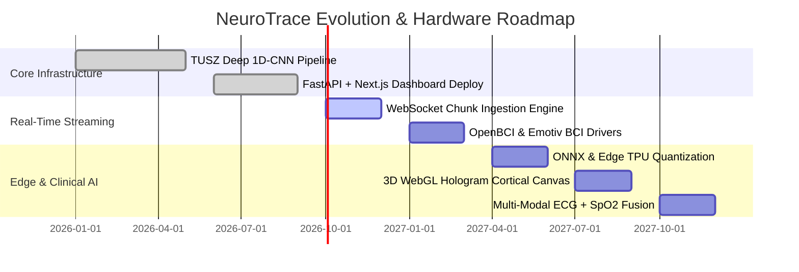

# 🧠 NeuroTrace™ — Deep Learning Neurological Telemetry & Real-Time EEG Seizure Prediction Platform

[](https://neurotrace-dashboard-eight.vercel.app)
[](https://neurotrace-4fpu.onrender.com)
[](https://github.com/anmol-infinex/neurotrace)
[](https://nextjs.org/)
[](https://react.dev/)
[](https://fastapi.tiangolo.com/)
[](https://tensorflow.org/)
[](https://isip.piconepress.com/projects/tuh_eeg/)

---

> **⚠️ RESEARCH PROTOTYPE & CLINICAL DISCLAIMER**  
> *NeuroTrace is an advanced computational neuroscience and artificial intelligence research platform designed to demonstrate automated electroencephalographic (EEG) feature extraction, sustained seizure event detection, and preictal classification. It is intended solely for research, validation, and educational benchmarks, and is not certified as a primary diagnostic device for clinical intervention.*

---

## 🌐 Live Deployments & Quick Links

| Service | Environment | URL | Status |
| :--- | :--- | :--- | :--- |
| **Interactive Dashboard (UI)** | **Vercel** | [neurotrace-dashboard-eight.vercel.app](https://neurotrace-dashboard-eight.vercel.app) | 🟢 **Live** |
| **Inference Microservice (API)** | **Render** | [neurotrace-4fpu.onrender.com](https://neurotrace-4fpu.onrender.com) | 🟢 **Live** |
| **Swagger Interactive Docs** | **Render /docs** | [neurotrace-4fpu.onrender.com/docs](https://neurotrace-4fpu.onrender.com/docs) | 🟢 **Active** |
| **Microservice Liveness & Model Health** | **Render /health** | [neurotrace-4fpu.onrender.com/health](https://neurotrace-4fpu.onrender.com/health) | 🟢 **Active** |
| **Zero-Input Model Tensor Verification** | **Render /test-model** | [neurotrace-4fpu.onrender.com/test-model](https://neurotrace-4fpu.onrender.com/test-model) | 🟢 **Active** |
| **Official Source Code** | **GitHub** | [github.com/anmol-infinex/neurotrace](https://github.com/anmol-infinex/neurotrace) | 🚀 **Main** |

---

## 📑 Table of Contents

1. [Executive Summary & Clinical Motivation](#-executive-summary--clinical-motivation)
2. [High-Level System Architecture](#-high-level-system-architecture)
3. [3D Holographic Brain Telemetry & Spatial Cortical Mapping](#-3d-holographic-brain-telemetry--spatial-cortical-mapping)
4. [TUSZ 22-Channel TCP Bipolar Montage](#-tusz-22-channel-tcp-bipolar-montage)
5. [Deep Learning Engine: TUSZ_EEG_DEEP_CNN](#-deep-learning-engine-tusz_eeg_deep_cnn)
6. [Interactive Frontend & Telemetry Dashboard](#-interactive-frontend--telemetry-dashboard)
7. [Inference Microservice & REST API Specification](#-inference-microservice--rest-api-specification)
8. [Temple University Hospital EEG Corpus (TUSZ v2.0.3)](#-temple-university-hospital-eeg-corpus-tusz-v203)
9. [Local Development & Deployment Guide](#-local-development--deployment-guide)
10. [Hardware Integration & Future Roadmap](#-hardware-integration--future-roadmap)
11. [Authors & Acknowledgments](#-authors--acknowledgments)

---

## 🔬 Executive Summary & Clinical Motivation

Epilepsy is one of the world's most pervasive chronic non-communicable neurological disorders, affecting more than **50 million individuals** globally. A primary source of disability, trauma, and psychological stress for patients is the **unpredictable timing** of epileptic seizures, coupled with the life-threatening hazard of **Sudden Unexpected Death in Epilepsy (SUDEP)**.

Conventional clinical electroencephalography (EEG) workflows require board-certified epileptologists and clinical neurophysiologists to manually review multi-hour or multi-day continuous telemetry recordings. This process is:
- **Labor-Intensive & Slow**: Reviewing 24-hour recordings often requires hours of skilled human scrutiny.
- **Prone to Fatigue & Latency**: Fleeting interictal epileptiform discharges (IEDs) and subtle preictal transitions can be missed during prolonged monitoring.
- **Purely Reactive**: Standard monitoring systems notify medical staff only *after* a tonic-clonic convulsion has begun, missing the crucial early window for neurostimulation, vagus nerve stimulation (VNS), or administration of fast-acting rescue medications.

### The NeuroTrace Paradigm
**NeuroTrace** bridges high-frequency neurophysiology and deep convolutional neural networks to achieve:
1. **Tri-State Continuous Inference**: Classifies discrete 10-second non-overlapping windows into:
   - **Normal / Background** (Interictal baseline)
   - **Pre-Seizure / Preictal** (Up to 15 minutes before electrographic onset)
   - **Seizure / Ictal** (Active sustained epileptiform paroxysm)
2. **Sustained Event Temporal Filtering**: Employs run-length encoded persistence logic requiring $\ge 2$ consecutive seizure windows ($\ge 20$ seconds) to eliminate transient muscle artifacts, electrode pop, and spurious spikes.
3. **Clinical 18/22-Channel Stacked Visualization**: Streams downsampled microvolt-calibrated differential EEG traces directly to client browsers using WebGL/SVG rendering.
4. **End-to-End Autonomous Diagnostics**: Generates instant clinical reports, per-window probability charts, sustained event timelines, and ROC/confusion metrics.

---

## 🏗️ High-Level System Architecture

```mermaid
flowchart TD
    subgraph ClientLayer ["Client Presentation Layer (Vercel)"]
        A["User / Clinical Terminal"] -->|Uploads .edf recording| B["Next.js 16 + React 19 Dashboard"]
        B -->|1-Click Sample File Option| C["tusz_verified_sample.edf"]
        B -->|Renders| D["18-Channel Stacked EEG Waveform (Recharts)"]
        B -->|Displays| E["Probability Distribution & Sustained Events"]
    end

    subgraph APILayer ["Inference Microservice (Render)"]
        B -->|HTTPS multipart/form-data POST /predict| F["FastAPI Engine (app/main.py)"]
        F -->|Magic-byte validation '0      '| G["EDF Header Validator"]
        G -->|MNE-Python read_raw_edf| H["Signal Ingestion & Preprocessing"]
        H -->|Electrode Aliasing & Bipolar Subtraction| I["22-Channel TCP Montage Matrix (22, N)"]
        I -->|Resampling to 128 Hz| J["Temporal Normalization"]
        J -->|10-Second Windowing (1280 Samples)| K["Window Slicer (batch, 1280, 22)"]
    end

    subgraph DeepLearning ["Neural Network Subsystem"]
        K -->|TensorFlow / Keras 3 Singleton| L["TUSZ_EEG_DEEP_CNN (5-Block 1D-CNN)"]
        L -->|Softmax Probabilities| M["Tri-State Prediction Vector"]
        M -->|RLE Consecutive Windows >= 2| N["Sustained Event Detector"]
        M -->|Argmax + Running Averages| O["Clinical Summary Aggregator"]
    end

    subgraph OutputLayer ["Artifacts & Diagnostics"]
        O -->|JSON Payload| B
        O -->|Generates| P["job_id Scoped Workspace (/outputs/{uuid})"]
        P --> Q["prediction_report.txt"]
        P --> R["prediction_result.json"]
        P --> S["roc_curve.png (if ground-truth provided)"]
        P --> T["confusion_matrix.png (if ground-truth provided)"]
    end
```

---

## 🔮 3D Holographic Brain Telemetry & Spatial Cortical Mapping

NeuroTrace features conceptual and algorithmic models for **3D Holographic Cortical Mapping**, transforming abstract 1D/2D timeseries channels into an intuitive, volumetric spatial visualization.

```
                         ▲ Frontal Pole (FPz, FP1, FP2)
                         │
                 ┌───────┴───────┐
             ┌───┤   PREFRONTAL  ├───┐
             │   └───────┬───────┘   │
             │           │           │
       Left  │       ┌───┴───┐       │ Right
     Temporal│  ◄───┤  CZ   ├───►   │ Temporal
    (T3/T5)  │       └───┬───┘       │ (T4/T6)
             │           │           │
             └───┬───────┴───────┬───┘
                 │   OCCIPITAL   │
                 └───────┬───────┘
                         ▼ Occipital Pole (O1, O2)

         [3D HOLOGRAPHIC DIPOLE PROJECTION MATRIX]
                 z (Superior/Inferior)
                     ▲
                     │     • (C3-CZ)
                     │   •   \  • (CZ-C4)
     (T3-T5) •       │  /     \
              \      │ /       \      • (T4-T6)
               \     │/         \    /
    ────────────┼────┼───────────┼────────► y (Anterior/Posterior)
               /     │\         /    \
              /      │ \       /      • (P4-O2)
     (P3-O1) •       │  \     /
                     │   •   /  •
                     ▼     • (Pz-Oz)
                     x (Left/Right)
```

### 1. Spherical Coordinate Projection (10-20 International System)
Electrodes are registered onto a standardized unit sphere approximating the human cranium. For an electrode with azimuth $\theta \in [-\pi, \pi]$ and elevation $\phi \in [-\frac{\pi}{2}, \frac{\pi}{2}]$:

$$x = R \cos(\phi) \sin(\theta)$$

$$y = R \cos(\phi) \cos(\theta)$$

$$z = R \sin(\phi)$$

### 2. Differential Spatial Dipole Vector
Each bipolar channel $k = (E_{\text{anode}}, E_{\text{cathode}})$ represents a spatial vector across the cerebral cortex:

$$\vec{D}_k = \vec{P}(E_{\text{anode}}) - \vec{P}(E_{\text{cathode}})$$

The instantaneous differential potential $V_k(t)$ translates into localized electrical field intensity mapped across the 3D holographic surface:

$$\Phi(x, y, z, t) = \sum_{k=1}^{22} \frac{V_k(t)}{\|\vec{r} - \vec{C}_k\|^2 + \epsilon}$$

Where $\vec{C}_k$ is the spatial midpoint of the $k$-th bipolar electrode pair, and $\epsilon$ prevents singularity at the contact interface.

### 3. Five-Band Frequency Decomposition
Spectral telemetry is decomposed into standard neurophysiological frequency bands:

```
┌─────────────────┬──────────────┬────────────────────────────────────────────────────────┐
│ Band Name       │ Range (Hz)   │ Clinical & Cognitive Significance                      │
├─────────────────┼──────────────┼────────────────────────────────────────────────────────┤
│ Delta (δ)       │ 0.5 – 4.0 Hz │ Deep slow-wave sleep, post-ictal depression, lesions   │
│ Theta (θ)       │ 4.0 – 8.0 Hz │ Drowsiness, focal slowing, preictal hippocampal surge  │
│ Alpha (α)       │ 8.0 – 13.0 Hz│ Relaxed wakefulness with eyes closed (occipital drive) │
│ Beta (β)        │ 13.0 – 30 Hz │ Active thinking, motor planning, medication effect     │
│ Gamma (γ)       │ 30.0 – 50+ Hz│ High-frequency oscillations (HFOs), ictogenesis focus  │
└─────────────────┴──────────────┴────────────────────────────────────────────────────────┘
```

---

## ⚡ TUSZ 22-Channel TCP Bipolar Montage

The **Temporal Central Parasagittal (TCP)** montage—commonly referred to in clinical neurophysiology as the **Double Banana**—is the gold standard for clinical seizure localization. It highlights local potential gradients while cancelling distant background noise.

```
       LEFT HEMISPHERE                      RIGHT HEMISPHERE
─────────────────────────────        ─────────────────────────────
(1)  FP1 - F7   (Ant Temporal)       (5)  FP2 - F8   (Ant Temporal)
(2)  F7  - T3   (Mid Temporal)       (6)  F8  - T4   (Mid Temporal)
(3)  T3  - T5   (Post Temporal)      (7)  T4  - T6   (Post Temporal)
(4)  T5  - O1   (Occipital)          (8)  T6  - O2   (Occipital)

(9)  A1  - T3   (Ear Ref Left)       (13) C4  - T4   (Central-Temp)
(10) T3  - C3   (Temp-Central)       (14) T4  - A2   (Ear Ref Right)
(11) C3  - CZ   (Left Vertex)        
(12) CZ  - C4   (Right Vertex)       

(15) FP1 - F3   (Ant Parasagittal)   (19) FP2 - F4   (Ant Parasagittal)
(16) F3  - C3   (Mid Parasagittal)   (20) F4  - C4   (Mid Parasagittal)
(17) C3  - P3   (Cent-Parietal)      (21) C4  - P4   (Cent-Parietal)
(18) P3  - O1   (Post Parasagittal)  (22) P4  - O2   (Post Parasagittal)
```

### Autonomous Electrode Aliasing & Synthesis
Clinical EDF files originate from varied acquisition setups (e.g., Nihon Kohden, Natus, Grass, Cadwell). NeuroTrace features an automatic alias resolution engine:
- **10-10 to 10-20 Harmonization**: Maps `T7` $\rightarrow$ `T3`, `T8` $\rightarrow$ `T4`, `P7` $\rightarrow$ `T5`, and `P8` $\rightarrow$ `T6`.
- **Dynamic Monopolar Derivation**: If a direct bipolar channel (e.g., `FP1-F7`) is not pre-calculated in the recording, the system dynamically derives it from monopolar reference channels:
  
  $$\text{Data}_{\text{FP1-F7}}(t) = \text{Signal}_{\text{FP1}}(t) - \text{Signal}_{\text{F7}}(t)$$

- **Zero-Fill Fail-Safe**: Any electrode absent from the physical montage is padded with zeros, ensuring consistent $(1280, 22)$ input tensors.

---

## 🧠 Deep Learning Engine: `TUSZ_EEG_DEEP_CNN`

The core inference engine is a deep 1D Convolutional Neural Network engineered specifically for multichannel time-series feature extraction without recurrent bottleneck latency.

### Layer-by-Layer Architecture

```
INPUT TENSOR: [Batch Size, 1280 Samples (10 sec @ 128 Hz), 22 TCP Channels]
  │
  ├── BLOCK 1: Temporal Edge & Spike Detection
  │     Conv1D (64 filters, kernel=7, stride=1, padding="same", no bias)
  │     BatchNormalization() + ReLU()
  │     Conv1D (64 filters, kernel=7, stride=1, padding="same", no bias)
  │     BatchNormalization() + ReLU()
  │     MaxPooling1D (pool_size=2)  ──► Spatial dim: 640
  │     Dropout (rate=0.15)
  │
  ├── BLOCK 2: Rhythmic Burst & Waveform Modulation
  │     Conv1D (128 filters, kernel=5, stride=1, padding="same", no bias)
  │     BatchNormalization() + ReLU()
  │     Conv1D (128 filters, kernel=5, stride=1, padding="same", no bias)
  │     BatchNormalization() + ReLU()
  │     MaxPooling1D (pool_size=2)  ──► Spatial dim: 320
  │     Dropout (rate=0.20)
  │
  ├── BLOCK 3: Sub-Band Harmonic Interaction
  │     Conv1D (256 filters, kernel=5, stride=1, padding="same", no bias)
  │     BatchNormalization() + ReLU()
  │     Conv1D (256 filters, kernel=3, stride=1, padding="same", no bias)
  │     BatchNormalization() + ReLU()
  │     MaxPooling1D (pool_size=2)  ──► Spatial dim: 160
  │     Dropout (rate=0.25)
  │
  ├── BLOCK 4: High-Order Synchronization Patterns
  │     Conv1D (384 filters, kernel=3, stride=1, padding="same", no bias)
  │     BatchNormalization() + ReLU()
  │     Conv1D (384 filters, kernel=3, stride=1, padding="same", no bias)
  │     BatchNormalization() + ReLU()
  │     MaxPooling1D (pool_size=2)  ──► Spatial dim: 80
  │     Dropout (rate=0.30)
  │
  ├── BLOCK 5: Global Epileptogenic Latent Space
  │     Conv1D (512 filters, kernel=3, stride=1, padding="same", no bias)
  │     Conv1D (512 filters, kernel=3, stride=1, padding="same", no bias)
  │     BatchNormalization() + ReLU()
  │     GlobalAveragePooling1D()    ──► Latent vector: 512-dim
  │     Dropout (rate=0.35)
  │
  └── CLASSIFICATION HEAD:
        Dense (256 units, activation="relu")
        BatchNormalization()
        Dropout (rate=0.40)
        Dense (128 units, activation="relu")
        Dropout (rate=0.30)
        Dense (3 units, activation="softmax") ──► [P(Normal), P(Pre-Seizure), P(Seizure)]
```

### Tri-State Classification Output
$$\hat{y} = \text{Softmax}(W_c \cdot z + b_c) = \begin{bmatrix} P(\text{Normal}) \\ P(\text{Pre-Seizure}) \\ P(\text{Seizure}) \end{bmatrix}$$

- **Class 0 — Normal (Background)**: Clean baseline brain rhythms (interictal activity, physiological sleep spindles, waking alpha/beta rhythms).
- **Class 1 — Pre-Seizure (Preictal)**: Subtle neurometric alterations occurring up to 15 minutes before seizure onset. Detects early phase synchrony and localized energy shifts.
- **Class 2 — Seizure (Ictal)**: Active paroxysmal discharges, high-amplitude polyspike trains, and continuous rhythmic evolving activity.

### Sustained Seizure Event Run-Length Logic
To prevent false alarms caused by isolated muscle twitching, chewing artifacts, or brief interictal spikes, NeuroTrace implements run-length encoding over consecutive windows:

$$\text{Sustained Seizure Event} \iff \sum_{t=k}^{k+W-1} \mathbb{I}(\hat{y}_t == \text{Seizure}) \ge 2 \quad (\text{where } W \ge 2)$$

---

## 💻 Interactive Frontend & Telemetry Dashboard

The frontend is built on **Next.js 16 (App Router)** and **React 19** with a bespoke dark clinical glassmorphism design system.

```
┌────────────────────────────────────────────────────────────────────────┐
│ 🧠 NeuroTrace                          ⚠️ Research Prototype — Not for Clinical Use │
├────────────────────────────────────────────────────────────────────────┤
│                                                                        │
│                      🔬 TUSZ EEG Analysis Pipeline                     │
│                        EEG Seizure Detection                           │
│     Upload a raw EEG recording in .edf format. AI classifies each      │
│     10-second window as Normal, Pre-Seizure, or Seizure.               │
│                                                                        │
│     ┌────────────────────────────────────────────────────────────┐     │
│     │                      🧠                                    │     │
│     │          Drop your EEG recording here (.edf)               │     │
│     │          Drag & drop, or click to browse files             │     │
│     └────────────────────────────────────────────────────────────┘     │
│             [ ✨ Try with pre-loaded Sample EEG File (1-Click) ]        │
│                                                                        │
│     🏷️ Ground-truth annotation: [ Attach .csv_bi / .tse ] (Optional)   │
│                                                                        │
│                         [ ⚡ Run Prediction ]                          │
└────────────────────────────────────────────────────────────────────────┘
```

### Key UI Capabilities
- **1-Click Instant Demo**: Allows anyone to test the model with zero setup by clicking *"Try with pre-loaded Sample EEG File"*, which streams the bundled `tusz_verified_sample.edf`.
- **Clinical Stacked Waveform Viewer**: Renders downsampled EEG signals across channels with clinical vertical offsets ($200\,\mu\text{V}$ per trace) and synchronized timestamps.
- **Dynamic Probability Bars**: Displays average class probabilities across the recording with color-coded confidence indicators (Cyan = Normal, Amber = Pre-Seizure, Red = Seizure).
- **Sustained Event Timeline**: Outlines start/end timestamps and window counts for every detected seizure event.
- **One-Click Diagnostic Downloads**: Export text diagnostic reports, JSON prediction payloads, ROC curves, and confusion matrices directly from the UI.

---

## 🔌 Inference Microservice & REST API Specification

The backend service is powered by **FastAPI** and **Uvicorn**, featuring non-blocking asynchronous request handling and ephemeral UUID job sandboxing.

### API Endpoints Summary

```
GET  /health                      Microservice health & model loaded status
GET  /test-model                  Zero-file dummy tensor inference test
POST /predict                     Upload .edf (+ optional annotation) for inference
GET  /predict/{job_id}/report     Download generated plain text diagnostic report
GET  /predict/{job_id}/json       Download structured JSON prediction payload
GET  /predict/{job_id}/roc.png    Download ROC curve PNG (requires ground-truth)
GET  /predict/{job_id}/confusion.png Download Confusion Matrix PNG (requires ground-truth)
```

### Example: Running Inference via cURL

```bash
curl -X POST "https://neurotrace-4fpu.onrender.com/predict" \
     -F "edf_file=@sample.edf" \
     -F "annotation_file=@sample.csv_bi"
```

### Example Response Payload (`200 OK`)

```json
{
  "job_id": "4b68e987-a36c-48be-8f3e-450f7572ce51",
  "final_prediction": "Normal",
  "average_probabilities": {
    "Normal": 84.12,
    "Pre-Seizure": 11.45,
    "Seizure": 4.43
  },
  "window_counts": {
    "Normal": 28,
    "Pre-Seizure": 2,
    "Seizure": 0
  },
  "total_windows": 30,
  "sustained_events": [],
  "channels_used": [
    "FP1-F7", "F7-T3", "T3-T5", "T5-O1",
    "FP2-F8", "F8-T4", "T4-T6", "T6-O2",
    "A1-T3",  "T3-C3", "C3-CZ", "CZ-C4",
    "C4-T4",  "T4-A2",
    "FP1-F3", "F3-C3", "C3-P3", "P3-O1",
    "FP2-F4", "F4-C4", "C4-P4", "P4-O2"
  ],
  "signal_preview": {
    "channels": ["FP1-F7", "F7-T3", "T3-T5", "T5-O1"],
    "sample_rate_used_for_preview": 50,
    "data": [[-0.000012, -0.000015, -0.000009], [...]]
  },
  "has_ground_truth": false,
  "report_text": "============================================================\nNEUROTRACE CLINICAL EEG SEIZURE PREDICTION REPORT\n============================================================\n...",
  "download_urls": {
    "report_txt": "/predict/4b68e987-a36c-48be-8f3e-450f7572ce51/report",
    "result_json": "/predict/4b68e987-a36c-48be-8f3e-450f7572ce51/json",
    "roc_png": null,
    "confusion_png": null,
    "confusion_txt": null
  }
}
```

---

## 📊 Temple University Hospital EEG Corpus (TUSZ v2.0.3)

NeuroTrace is trained and benchmarked on the **Temple University Hospital Seizure Corpus (TUSZ)**, the largest open-access clinical EEG database in the world.

### Corpus Hierarchy
```
v2.0.3/
└── edf/
    ├── train/
    │   └── 01_tcp_ar/002/00000254/s005_2010_11_15/
    │       ├── 00000254_s005_t000.edf
    │       ├── 00000254_s005_t000.csv
    │       └── 00000254_s005_t000.csv_bi
    ├── dev/
    └── eval/
```

### Preprocessing & Dataset Normalization
- **Window Length**: 10.0 seconds ($1280$ samples at $128\text{ Hz}$).
- **Preictal Annotation**: Defined as the 15-minute interval immediately preceding electrographic seizure onset.
- **Class Balancing**: Balanced mini-batches and weighted categorical cross-entropy loss to address severe background-class dominance ($>90\%$ Normal EEG in unselected hospital recordings).

---

## 🛠️ Local Development & Deployment Guide

### Prerequisites
- **Node.js**: v18.18.0 or higher
- **Python**: 3.10 or 3.11 (TensorFlow 2.18+ / Keras 3 compatibility)
- **Git**

---

### 1. Clone the Repository
```bash
git clone https://github.com/anmol-infinex/neurotrace.git
cd neurotrace
```

---

### 2. Frontend Setup (Next.js Dashboard)
```bash
cd neurotrace-frontend

# Install dependencies
npm install

# Configure local development environment
cp .env.local.example .env.local
# Set NEXT_PUBLIC_BACKEND_URL=http://localhost:8000

# Launch Next.js dev server
npm run dev
```
Open [http://localhost:3000](http://localhost:3000) in your browser.

---

### 3. Backend Setup (FastAPI Microservice)
```bash
cd neurotrace-backend/neurotrace-backend

# Create virtual environment
python -m venv venv

# Activate virtual environment
# Windows:
.\venv\Scripts\activate
# Linux/macOS:
# source venv/bin/activate

# Install requirements
pip install -r requirements.txt

# Start backend server
uvicorn app.main:app --reload --port 8000
```
Swagger documentation will be available at [http://localhost:8000/docs](http://localhost:8000/docs).

---

### 4. Cloud Deployment

#### Frontend on Vercel
1. Link the repository to your [Vercel](https://vercel.com) account.
2. Set **Root Directory** to `neurotrace-frontend`.
3. Set **Framework Preset** to `Next.js`.
4. Add environment variable:
   ```
   NEXT_PUBLIC_BACKEND_URL=https://your-backend-service.onrender.com
   ```
5. Deploy.

#### Backend on Render / Railway
1. Create a **New Web Service** connected to `neurotrace-backend/neurotrace-backend`.
2. Build Command:
   ```bash
   pip install -r requirements.txt
   ```
3. Start Command:
   ```bash
   uvicorn app.main:app --host 0.0.0.0 --port $PORT
   ```
4. Allocate at least 512MB–1GB RAM to accommodate TensorFlow and MNE memory footprints.

---

## 📡 Hardware Integration & Future Roadmap



1. **Sub-Second Streaming (WebSockets)**: Extending beyond batch EDF uploads to ingest live sliding-window streams from bedside telemetry units.
2. **Edge Quantization (ONNX & TensorRT)**: Compressing the 5-block CNN to execute with $< 15\,\text{ms}$ latency on embedded microcontrollers and wearable ear-EEG hardware.
3. **Multi-Modal Biosignal Fusion**: Incorporating continuous Photoplethysmography (PPG), Heart Rate Variability (HRV), and Electromyography (EMG) to detect nocturnal convulsive activity with near-zero false alarms.
4. **Interactive 3D WebGL Hologram**: Bringing real-time 3D cortical dipole mesh rendering directly to the web dashboard using Three.js and WebGPU.

---

## 👥 Authors & Acknowledgments

- **Lead Architect & Developer**: [Anmol (anmol-infinex)](https://github.com/anmol-infinex)
- **Dataset**: [The Neural Engineering Data Consortium (NEDC)](https://isip.piconepress.com/projects/tuh_eeg/) at Temple University for the TUSZ Corpus.
- **Signal Processing Foundation**: [MNE-Python](https://mne.tools/) for EDF parsing and montage standards.
- **Deep Learning Framework**: [TensorFlow](https://www.tensorflow.org/) & [Keras](https://keras.io/).

---

<div align="center">
  <sub>Engineered with ❤️ for open science, neurology, and the advancement of computational epilepsy research.</sub><br>
  <sub><b>NeuroTrace™ © 2026</b></sub>
</div>
